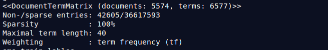
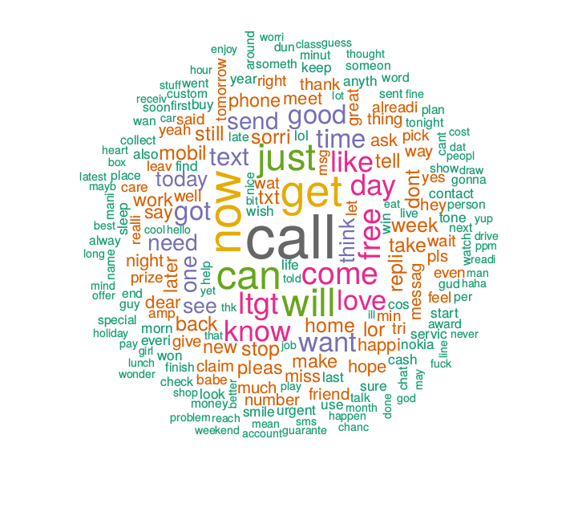
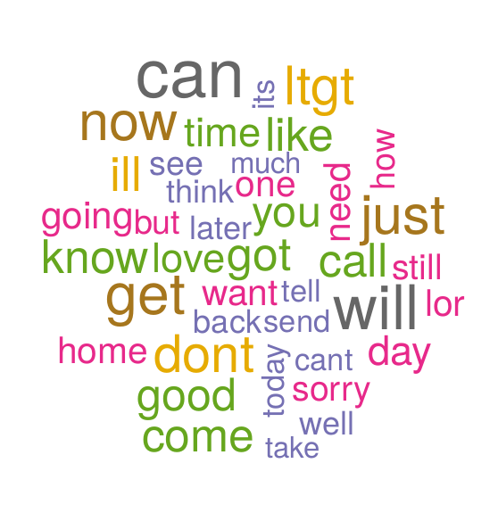
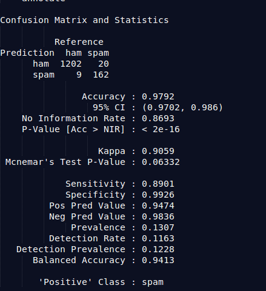
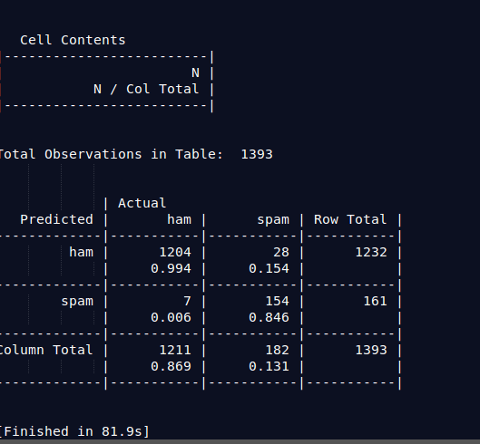
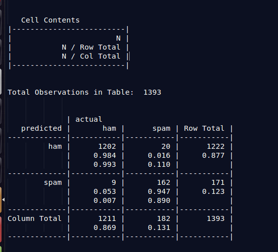

## Predictive-SMS-Spam-Detection
### Objective:  to classify SMS message as spam or not spam (ham).

01) . Use Bayes theorem (or its extension) and write down the corresponding conditional probability of the study problem.

According to this data set, it includes the text of SMS messages that are labeled spam or ham. when analyzing sample sms, the spam labeled messages use the word “free” frequently, yet the word “free”does not appear in any of the ham messages.

The probability that the word “free” was used in previous spam messages is called ; 
P(free/spam).

The probability that “free” appeared in any message at all is called marginal likelihood; 
P(free)

posterior probability ; P(spam/free)  measures how likely the message is to be a spam, it can be computed  by applying Bayes’ theorem. 

                (P(spam) * P(free/spam))
P(spam/free) = --------------------------------------
                       
                       P(free)

From the given data set, use Naïve Bayes to classify the SMS message.
Used R packages: 
Package tm (text mining), SnowballC (stemming words), word clouds, RColorBrewer (color palettes in word clouds), Package e1071 for naïve_bayes()

The framework for text classification is briefly summarized here:

2.1) transformation

Cleaning and standardizing text data is  the important section. Here, tm package provides functionality to transform word into lower case, remove numbers and word stemming etc. Stop word function can use to remove filler words.Stopwords are words that are particularly common in a text corpus and thus considered as rather uninformative (e.g., words such as so, and, or, the, …”).  Stemming is common standardization method reducing words to their root form. This saves processing time for machine learning algorithms. SnowballC package provides stemming functionality. 

2.2) Document-Term-Matrix creation

Matrix of word counts for each individual document in the matrix (e.g. documents as rows, words as columns or vice versa)
This is the  final step of data preparation. This is called as tokenization process.Tokenization describes the general process of breaking down a text corpus into individual elements that serve as input for various natural language processing algorithms. The tm package provides DocumentTermMatrix() function for tokenization. Document Term Matrix is a data structure, in which sms message indicates as a row and words indicate as columns. 

2.3) Text Analysis (e.g. word counts, visualizations using word clouds)

The word cloud provides good visualization for the frequency of words in text data. The cloud contains words that are scattered randomly around the figure. The front size  is scaled according to frequency of words in text data. Following three figures provide good visualization for spam and ham words.  

Figure 01: Word cloud for prepared SMS corpus.

Figure 02: Word cloud for subset where the message type is spam

According to figure 02 spam messages include words- free, mobile, claim, prize and urgent. 

Figure 03: Word cloud for subset where the message type is ham

According to figure 03 ham messages include words- day, come, can, sorry and home. 

What is the accuracy of the model? Accuracy = 0.9792

Figure 04: Cross table 

### Evaluating model Performance

According to the above cross table 9 + 20 = 29 of the 1393 sms messages were incorrectly classified. Error rate is 2.08%. Among errors,  ham messages were 9 out of 1211,  that were misclassified as spam and 20 out of 182 spam messages were misclassified as ham. According to  the accuracy of the model, it  proves that Naive Bayes has impressive performance on identifying and predicting whether it is a ham or spam message.

#### Improve the model performance

Adding Laplace estimator changes the model performance. Because Laplace smoothing technique can  be used to smooth categorical data. Above training model didn’t set Laplace estimator. That means the model allows words that appeared in zero spam or zero ham messages to have an indisputable decision in the classification process. 

#### Adding Laplace = 1 , measure the performance. 
 
 

Adding the Laplace estimator reduced the number of false positives. But it increased the number of false negatives. 

you think the accuracy If the data set is bigger, do increases? 
 
Naive Bayes classifier can outperform well with small sample sizes(Domingos & Pazzani, 1997). A larger training set decreases the score because it is more difficult for the learning algorithm to learn a model that correctly represents all the training data. 

 
### Reference

Domingos, P., & Pazzani, M. (1997). On the Optimality of the Simple Bayesian Classifier under Zero-One Loss. Machine Learning, 29(2-3), 103–130. https://doi.org/10.1023/A:1007413511361

Lantz, B. (2013). Machine Learning with R. Packt Publishing Ltd.

